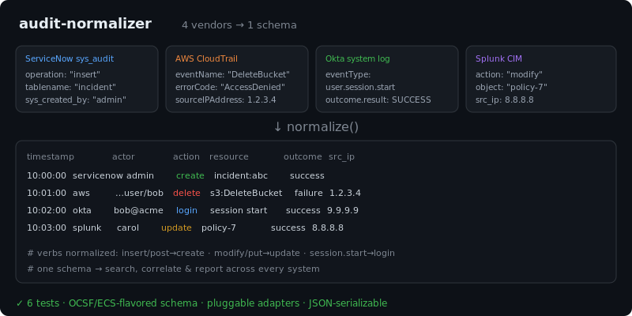

# audit-normalizer

[](https://github.com/JCreatesGH/audit-normalizer/actions)
[](https://www.python.org/)
[](LICENSE)

Audit data lives in a dozen incompatible shapes. `auditnorm` maps logs from **ServiceNow**, **AWS CloudTrail**, **Okta**, **Splunk**, **GCP Cloud Audit**, **Azure Activity**, **GitHub**, **Kubernetes audit**, **Microsoft 365**, and **Cloudflare** into one common, OCSF/ECS-flavored schema so you can search, correlate, and report on activity across every system — and it can **auto-detect** which format each record is.



## Install

```bash
pip install auditnorm
```

## Use it

```python
from auditnorm import normalize, normalize_all

events = normalize(cloudtrail_records, source="aws")
for e in events:
    print(e.timestamp, e.source_system, e.actor, e.action, e.resource, e.outcome)
    e.to_dict()    # JSON-serializable common record

# merge several systems into one sorted timeline
timeline = normalize_all({"aws": cloudtrail_records, "okta": okta_records})
```

## CLI

Installing the package adds an `auditnorm` command — pipe raw logs in, get the common schema out:

```bash
$ auditnorm okta-events.json --source okta            # JSON array of common records
$ cat cloudtrail.json | auditnorm --source aws --ndjson
$ auditnorm bundle.json --all                         # bundle = {"aws":[...], "okta":[...]}
$ auditnorm mixed.json --auto                          # a flat list of mixed records; detect each
```

## The common schema

`timestamp · source_system · actor · action · resource · outcome · source_ip · raw_action`

- **Normalized verbs** — vendor actions map to a small set: `insert/post → create`, `modify/put → update`, `remove/destroy → delete`, `user.session.start → login`, etc. (`raw_action` keeps the original). Dotted/slashed verbs (GCP `storage.buckets.delete`, Azure `…/virtualMachines/delete`) are reduced to their last segment first.
- **Outcome** — every source's status/result is mapped to `success` / `failure` / `unknown` (CloudTrail `errorCode`, GCP `status.code`, Azure `status`/`resultType`, Okta `outcome.result`, Splunk `status`/`result`, …) so the field is genuinely uniform.
- **Adapters are plain functions** (`from_servicenow`, `from_cloudtrail`, `from_okta`, `from_splunk`, `from_gcp`, `from_azure`, `from_github`, `from_kubernetes`, `from_m365`, `from_cloudflare`), so adding a new source is a few lines.
- **Auto-detection** — `detect_source(record)` identifies a record's format from its signature fields; `normalize_auto(records)` normalizes a mixed list and merges it into one timeline.

Kubernetes audit maps the request `verb`/`objectRef`/`responseStatus.code` (≥400 → `failure`),
Microsoft 365 maps the Unified Audit Log (`Operation`/`ResultStatus`/`ClientIP`), and Cloudflare
maps its `actor`/`action`/`resource` objects (`action.result` false → `failure`).

## Development

```bash
pip install -e .[dev] && python -m pytest -q   # 19 tests
```

## License

MIT
